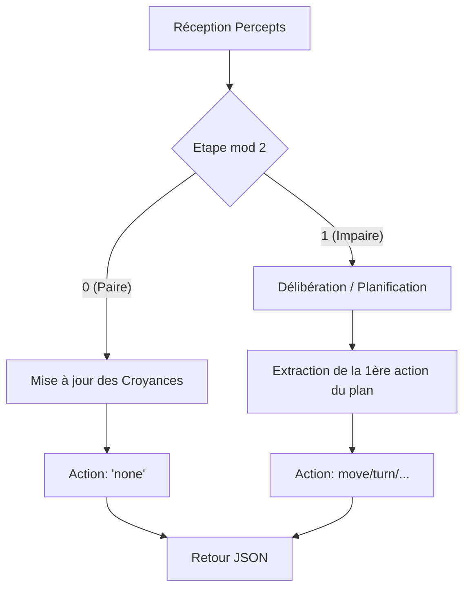

# Chasseur du Monde du Wumpus - HW2


Un agent intelligent autonome basé sur le modèle **BDI** (Croyance-Désir-Intention), implémenté en **SWI-Prolog**. Il résout le problème du Monde du Wumpus en naviguant via une interface HTTP REST, en gérant l'incertitude par des partitions épistémiques et en planifiant ses actions avec l'algorithme A*.

---

## Table des Matières

1. [Équipe](#équipe)
2. [Description du Projet](#description-du-projet)
3. [Architecture des Fichiers](#architecture-des-fichiers)
4. [Modèle BDI](#modèle-bdi)
5. [Représentation des Connaissances](#représentation-des-connaissances)
6. [Rythme Pair/Impair](#rythme-pairimpair)
7. [Prérequis](#prérequis)
8. [Installation](#installation)
9. [Lancement](#lancement)
10. [Logs de Débogage](#logs-de-débogage)
11. [Règles de Codage](#règles-de-codage)

---

## Équipe

- **Mohamed Amine Barhoumi**
- **Claude Epo**
- **Patrick Gomes**
- **Franka Lebaramo**

*ESIEA Paris, 4A IADS, 2025–2026*

---

## Description du Projet

L'agent **Hunter** est conçu pour explorer un environnement hostile (grille de $N \times M$) afin de récupérer un trésor (l'or) et de s’échapper. Ses capacités incluent :
- **Perception active** : Analyse des odeurs (*stench*), brises (*breeze*), et lueurs (*glitter*).
- **Raisonnement spatial** : Localisation du Wumpus et des puits par déduction logique (ILP).
- **Navigation sécurisée** : Déplacement uniquement sur des cases garanties sans danger.
- **Combat stratégique** : Capacité de tirer une flèche pour éliminer le Wumpus s'il bloque le chemin.

---

## Architecture des Fichiers

| Fichier | Rôle Exact |
| :--- | :--- |
| `hunter_server.pl` | Point d'entrée. Serveur HTTP REST (port 8081) gérant les échanges JSON. |
| `hunter.pl` | Cœur de l'agent : boucle BDI, délibération, planificateur A* et mise à jour de l'état. |
| `theory_wumpus.pl` | Logique déductive issue de l'apprentissage (ILP) pour la classification des dangers. |
| `wumpus_cbr.pl` | Module optionnel de raisonnement à partir de cas (CBR) pour l'aide à la décision. |
| `background.pl` | Connaissances de fond (topologie, adjacence) pour le moteur d'apprentissage Aleph. |

---

## Modèle BDI

L'agent Hunter suit une architecture **Belief-Desire-Intention** stricte :

1.  **Croyances (*Beliefs*)** :
    - L'état interne maintient des **partitions épistémiques** pour chaque danger.
    - Il stocke les connaissances "éternelles" (murs, sortie) et "fluentes" (position, orientation).
2.  **Désirs (*Desires*)** :
    - Évalués par le prédicat `deliberate/3`.
    - Priorités : 
        1. Ramasser l'or (`grab`).
        2. Sortir (`climb`) si l'or est possédé.
        3. Éliminer le Wumpus (`shoot`) si détecté.
        4. Explorer les zones inconnues et sûres.
3.  **Intentions** :
    - Plans d'actions générés par **A*** (ex: `[move, left, move]`).
    - L'agent s'engage dans son intention jusqu'à complétion ou apparition d'une perception invalidante (*bump*, nouvelle odeur).

---

## Représentation des Connaissances

Les dangers (Wumpus/Puits) sont gérés via trois partitions épistémiques :

| Partition | Signification | Exemple de Transition |
| :--- | :--- | :--- |
| `knownTrue` | Danger confirmé à 100%. | Une odeur en (1,1) et (2,1) + vent en (1,2) $\rightarrow$ Wumpus identifié en (2,2). |
| `knownFalse` | Case garantie sans danger. | Passage sur la case ou absence de perception adjacente (ex: pas d'odeur en 1,1). |
| `orTrue` | Case suspecte (incertitude). | Perception d'une odeur : toutes les cases adjacentes non visitées passent en `orTrue`. |

---

## Rythme Pair/Impair

Pour garantir la synchronisation avec le simulateur, l'agent opère sur un cycle de deux étapes par action physique :



---

## Prérequis

- **SWI-Prolog** $\ge$ 8.4
- Bibliothèque **reif** (logique réifiée pour `if_/3`).
  - Installation : `?- pack_install(reif).`

---

## Installation

```bash
git clone https://github.com/votre-repo/wumpus-hunter.git
cd wumpus-hunter/ai-prolog/wumpussimhunter
```

---

## Lancement

1.  **Démarrer le simulateur** :
    Accédez au dossier `wumpussimserver/` et lancez l'exécutable ou le script de simulation (port 8080).
2.  **Démarrer l'agent** :
    ```bash
    swipl hunter_server.pl
    ```
    L'agent écoute sur le port **8081**.

---

## Logs de Débogage

L'agent produit des logs détaillés sur `user_error` pour faciliter le suivi :

| Préfixe | Signification | Exemple |
| :--- | :--- | :--- |
| `[hunter]` | Flux principal de l'agent. | `Processing Step 14...` |
| `[debug]` | Détails du raisonnement interne. | `Wumpus Update Pre: KT=[cell(2,2)], KF=[cell(1,1)], OT=[]` |
| `[debug]` | Décision de mouvement. | `DECIDE MOVE: From=... To=...` |

---

## Règles de Codage Respectées

Le code suit des standards de programmation logique pure :
- Utilisation de **clpfd** pour l'arithmétique.
- Utilisation de **reif** (`if_/3`) pour les conditionnels déclaratifs.
- Utilisation de **dif/2** pour les contraintes d'inégalité.
- **Aucun** `assert/retract` (état passé via récursion d'arguments).
- **Aucun** `is/2` ou comparaison standard (`<`, `>`).
- **Aucun** opérateur "cut-fail" ou `(->)/2` dans la logique métier.
