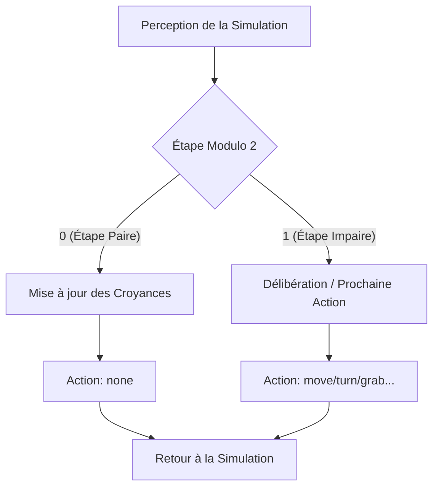

# Chasseur du Monde du Wumpus — Agent BDI en Prolog


Un agent intelligent professionnel basé sur le modèle BDI (Croyance-Désir-Intention), implémenté en SWI-Prolog. Il navigue de manière autonome dans le Monde du Wumpus, gère l'incertitude épistémique et communique via une interface HTTP REST.

---

## Table des Matières
1. [Architecture](#architecture)
2. [Modèle Mental BDI](#modèle-mental-bdi)
3. [Représentation des Connaissances](#représentation-des-connaissances)
4. [Contrôle du Rythme (Étape Pair/Impair)](#contrôle-du-rythme-étape-pairimpair)
5. [Installation et Configuration](#installation-et-configuration)
6. [Exécution du Projet](#exécution-du-projet)
7. [Logs de Débogage](#logs-de-débogage)
8. [Limitations Connues / Travaux Futurs](#limitations-connues--travaux-futurs)


---


## Architecture
Le projet est divisé en trois composants principaux :

| Fichier | Rôle |
| :--- | :--- |
| `hunter_server.pl` | Point d'entrée. Enveloppe l'agent dans un serveur HTTP (port 8081) via `library(http)`. |
| `hunter.pl` | Boucle BDI principale. Gère la mise à jour des croyances, la délibération A* et le choix des actions. |
| `theory_wumpus.pl` | Théorie déclarative pour la détection du Wumpus (validée par ILP), gérant les transitions épistémiques. |
| `reif.pl` | Module utilitaire fournissant la logique réifiée (`if_/3`) pour une programmation purement déclarative. |
| `wumpussimserver/` | L'environnement de simulation qui héberge la grille du Monde du Wumpus. |

---

## Modèle Mental BDI
L'agent suit le cycle classique **Croyance-Désir-Intention** :

- **Croyances (Beliefs)** : Un dictionnaire structuré stocké dans l'état de l'agent. Il inclut des fluents (position, statut de l'or), des éternels (murs, position de la sortie) et des **partitions épistémiques** pour les dangers.
- **Désirs (Desires)** : Objectifs de haut niveau prioritaires pour le moteur de délibération :
    1. **Ramasser l'Or** : Si une brillance (`glitter`) est détectée.
    2. **Rentrer à la Maison** : Si l'or a été récupéré.
    3. **Tuer le Wumpus** : Si une position confirmée est dans la ligne de mire.
    4. **Explorer la Frontière** : Naviguer en toute sécurité vers des cellules non visitées.
- **Intentions** : Une liste concrète d'actions (ex: `[move, right, move, grab]`) générée par le planificateur A* et stockée dans la croyance `intention_plan`.

---

## Représentation des Connaissances
L'agent utilise des **partitions épistémiques** pour représenter sa connaissance des dangers (Wumpus et Puits). Chaque cellule est classée dans l'une des trois partitions :

- `knownTrue` : Le danger est définitivement présent à cet endroit.
- `knownFalse` : La cellule est définitivement sûre.
- `orTrue` : La cellule est un *suspect* (ex: adjacente à une odeur/brise mais non confirmée).

`theory_wumpus.pl` contient la logique de transition entre ces états. Par exemple, si le chasseur est en (1,1) et ne sent rien, tous les voisins (1,2) et (2,1) passent en `knownFalse`. Si une odeur est sentie et qu'un seul voisin n'est pas `knownFalse`, il passe en `knownTrue`.

---

## Contrôle du Rythme (Étape Pair/Impair)
L'agent implémente un **rythme Pair/Impair** pour séparer le calcul de l'action physique. Cela garantit que l'état de l'environnement reste synchronisé pendant que l'agent "réfléchit".




## Installation et Configuration
Cloner le dépôt :
   ```bash
   git clone <url-du-depot>
   cd ai-prolog/wumpussimhunter
   ```

---

## Exécution du Projet
1. **Démarrer le serveur du chasseur** :
   ```bash
   swipl hunter_server.pl
   ```
   Le serveur démarrera sur `http://localhost:8081`.

2. **Connecter la simulation** :
   Ouvrez l'environnement de simulation (fourni dans le répertoire `wumpussimserver`) et pointez-le vers l'URL du serveur du chasseur.

---

## Logs de Débogage
L'agent affiche des logs détaillés dans la console. Recherchez les préfixes `[debug]` et `[hunter]` :

- `[hunter] Processing Step X...` : Indique l'étape actuelle de la simulation.
- `[debug] Wumpus Update Pre/Post` : Affiche la taille des partitions épistémiques (`KT`, `KF`, `OT`) avant et après le traitement des perceptions.
- `[debug] DECIDE MOVE` : Affiche la position actuelle, la cellule cible et le statut des dangers avant une action `move`.

---

## Limitations Connues / Travaux Futurs
- **Heuristique de base** : L'implémentation A* utilise actuellement la distance de Manhattan. Une heuristique plus complexe prenant en compte le coût des rotations améliorerait l'efficacité.
- **Injection de la "Ground-Truth"** : À l'étape 0, l'agent "regarde" le serveur de simulation pour cartographier les murs. Un agent réellement autonome devrait les découvrir uniquement via la perception `bump`.
- **Gestion de la mémoire** : Sur de très grandes grilles, la liste des cellules visitées et les dictionnaires de partitions peuvent croître significativement.


